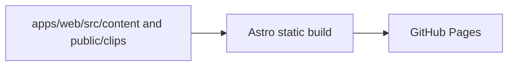

# Architecture

This repository is the clippings site. Markdown clips and assets live in
`apps/web/src/content/clips/` and `apps/web/public/clips/`; Astro builds that
content into a static site that GitHub Actions deploys to Pages. There is no
database, backend, or runtime service.

The `clip` CLI for authoring clips is a separate project published as the
`cliplink` npm package ([iamrajjoshi/cliplink](https://github.com/iamrajjoshi/cliplink)).
It writes clips into this repository's content collection, either locally or
remotely through the GitHub REST API.

`site.config.mjs` supplies the owner, title, description, origin, base path, and
optional repository. GitHub Pages provides its origin and base path at build
time, so project sites work without changing the CLI's root-relative assets.
The same URL helper handles rendered cards, Markdown, RSS, and the search index.

Example fixtures have their own Astro collection and render only at `/demo/`.
They never enter the published clip collection or its RSS and search outputs.
